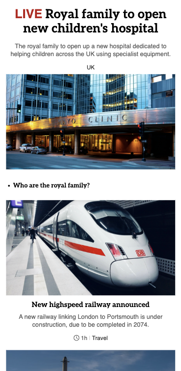
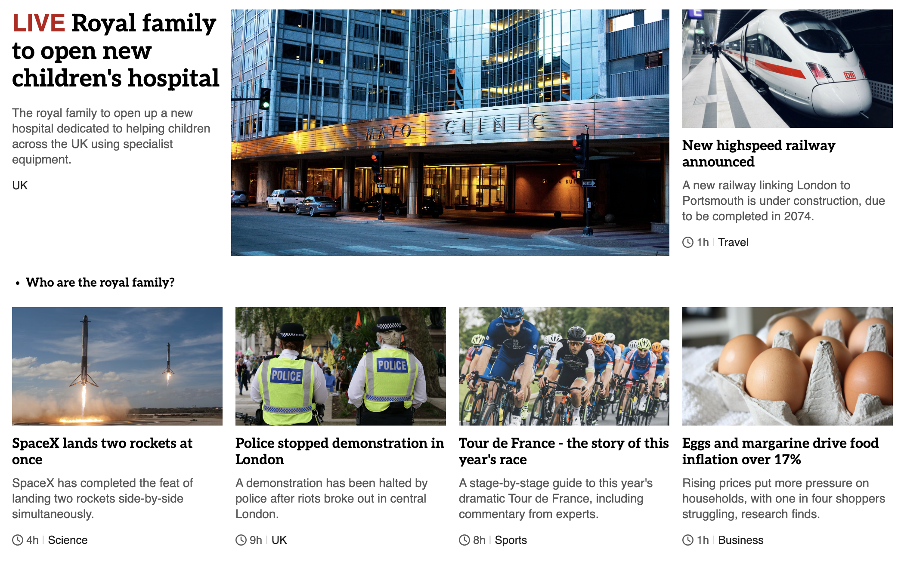

# BBC-Clone

Exercise creating a simple layout similar to BBC's site, using grid and flexbox.

## Table of Contents

- [Purpose and Goals](#purpose-and-goals)
- [Features](#features)
- [Usage](#usage)
- [License](#license)
- [Screenshots](#screenshots)
- [Future Development](#future-development)
- [Deployed Link](#deployed-link)

## Purpose and Goals

The purpose of this mini-project is to practice using CSS Grid primarily, plus Flexbox as needed.

The main goal is to create a web page that shows different news articles in a responsive layout.

## Features

- The layout appears similar to the BBC website
- The layout will adjust based on screen size
- The "news" will be hard-coded in the html

## Usage

Either visit [BBC Clone](https://caitlinw29.github.io/bbc-clone/) in any browser, or fork this repository to use locally and make some changes.

## License

This project is licesensed under the [MIT](https://opensource.org/licenses/MIT) license.

## Screenshots
Mobile View:

Desktop View:

## Future Development
- Improve UI
- Light/Dark mode toggle
- Pull in real news articles with an API?
- Add some buttons, and functionality with JS

## Deployed Link

See it live: [BBC Clone](https://caitlinw29.github.io/bbc-clone/)